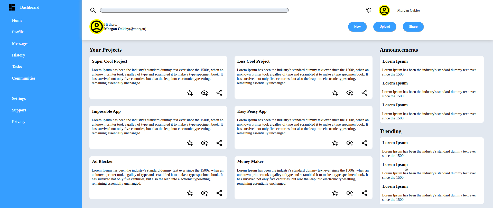

# Admin Dashboard

This project is an admin dashboard built using CSS Grid.

## Description

The admin dashboard provides a user interface for managing various tasks, projects, and announcements. It incorporates CSS Grid for layout design, ensuring responsiveness and flexibility across different screen sizes.

## Features

- Navigation menu for easy access to different sections.
- User profile information and search functionality.
- Display of projects with detailed information.
- Announcement and trending sections for keeping users informed.
- Responsive design for optimal viewing on various devices.

## Usage

To use this admin dashboard:
1. Clone the repository to your local machine.
2. Open the `index.html` file in your web browser.
